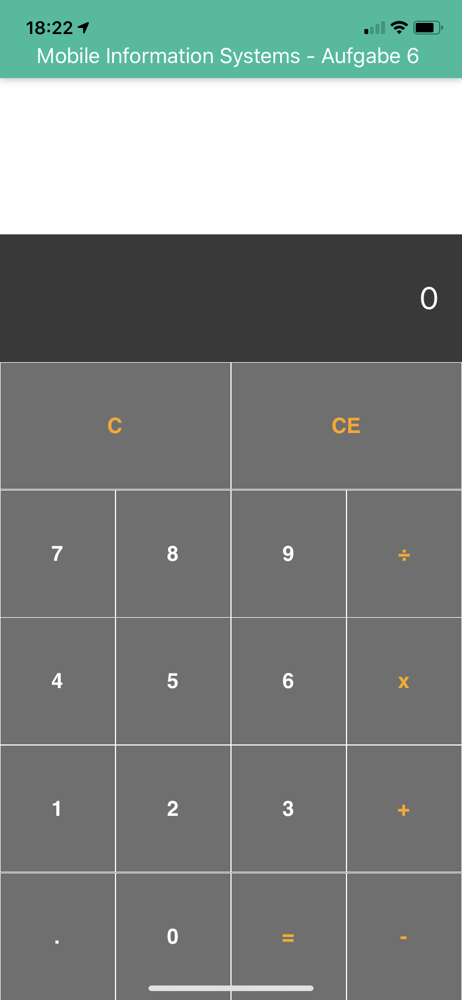
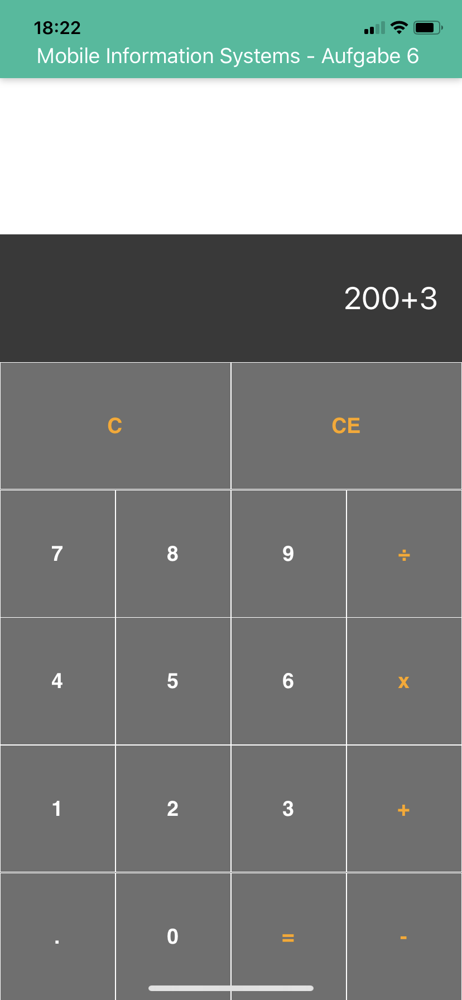
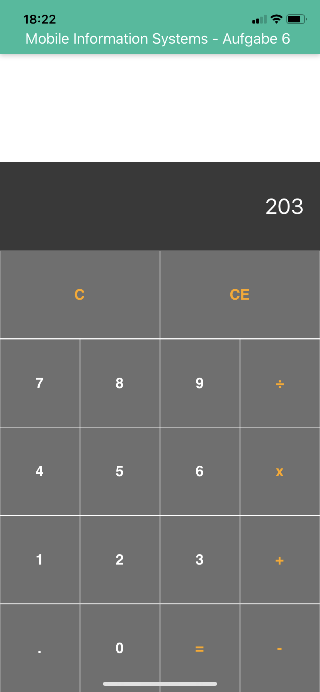

## Aufgabe 6 , Simple Calculator
<div align="center">
    
</div>

<br/>


# Getting started

### Familiar with Git?

clone this repository 

```
git clone https://github.com/taherbensassi/calculator.git


```

### Not familiar with Git?

- <a href="https://github.com/taherbensassi/calculator.git">Download ZIP</a>
- extract the contents of the zip file
- and `cd` into `calculator` folder `cd calculator`

### Install dependencies

```
npm install
```

### Start development server

```
npm start
```


    


   
   
    
  


## Author

* Taher Ben Sassi taher.sassi.isamm@gmail.com